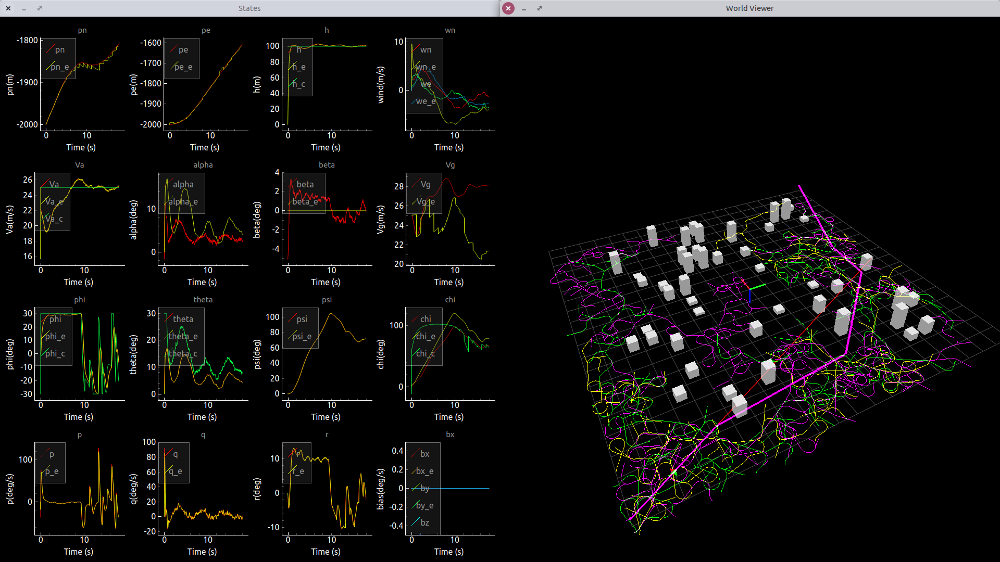

# EC EN 674 Flight Dynamics Controls

Code based on *Small Unmanned Aircraft: Theory and Practice* by Randal Beard and Tim McLain  
Reference: uavbook.byu.edu

Youtube videos demonstrating each chapter implementation can be found [here.](https://www.youtube.com/playlist?list=PLa79EwlpK4ZMsxfw_ab-9_kLygiABV4_z)

# Installation
This project is compatible with Python 3.6.8. It is NOT compatible with Python 2 as there are dependent packages which are not Python 2 compatible.  

Install needed dependencies:  
`pip3 install numpy scipy matplotlib pyqtgraph control PyOpenGL stl`

# Run
`cd` into the chapter or project directory and run:  
`python3 mavsim_*.py`
  

